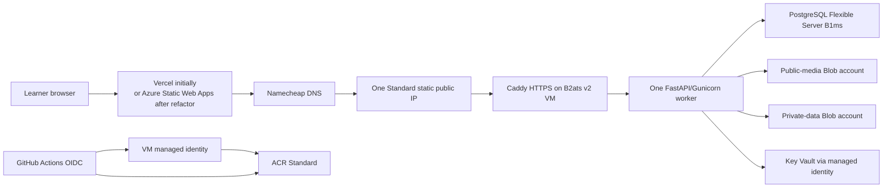

# LingoAI: AWS-to-Azure Zero-Cost Migration Report

**Prepared:** 12 August 2026
**Azure 12-month benefit expiry supplied by the account owner:** 18 June 2027
**Time remaining at preparation:** 310 days
**Scope:** Production infrastructure, application changes, data migration, CI/CD, security, capacity, cost controls, and eventual free-tier exit.

## Executive decision

LingoAI can run as a small, single-instance production service inside the listed Azure 12-month allowances, but only after reducing its production architecture and enforcing usage caps in code. It cannot preserve the availability, redundancy, or operational headroom of the former AWS design for zero Azure cost.

The recommended zero-cost Azure shape is:

- one Linux `Standard_B2ats_v2` VM with one P6 OS disk and one public IP;
- Caddy on the VM for HTTPS and reverse proxying;
- one Azure Database for PostgreSQL Flexible Server `Standard_B1ms`, with 32 GiB storage and no high availability;
- Azure Blob Storage Hot LRS, kept below 4 GiB and with lifecycle deletion;
- one Azure Container Registry Standard instance;
- Azure Key Vault Standard, accessed using managed identities;
- no Redis, load balancer, NAT Gateway, VPN Gateway, Service Bus, Application Gateway, Azure DNS, Log Analytics ingestion, or paid Defender plan;
- initially keep the frontend on Vercel, or refactor it to a stable static export before moving it to Azure Static Web Apps Free;
- one backend process, no Azure staging environment, a maintenance window for deployments, and hard application quotas.

This is a **controlled zero-cost operating envelope, not a guarantee that Azure can never issue an invoice**. Azure budgets notify but do not stop resources, cost data can lag, free allowances do not roll over, and a wrong SKU, region, disk, IP, networking feature, backup choice, or Marketplace item can be billable. The account's Azure Portal meter is the authoritative entitlement; Microsoft's public free-services page is only a cross-check.

There is a second important distinction:

- **$0 Azure infrastructure** is feasible under the constraints in this report.
- **$0 total LingoAI cloud cost** is not feasible without product changes. The current application can call OpenAI, Pinecone, Deepgram, Resend, Sentry, Vercel, Razorpay, and other non-Azure services. Azure OpenAI is not included in the supplied free benefits. Those services must have their own free plan or spending cap, or the dependent feature must be disabled.

## Immediate risks—do these before migration work

1. **Disable or replace `.github/workflows/deploy.yml` before the next push to `main`.** It still authenticates to AWS, pushes to ECR, runs ECS migration/seed tasks, deploys ECS, performs smoke tests, and can roll back ECS. Revoking AWS does not make this workflow safe or useful.
2. **Locate production data outside this repository.** No `.dump`, `.backup`, `.sql`, Terraform state, production `.env`, or media export was found. If the RDS instance and S3 buckets are already inaccessible and no snapshot/export exists, the production data cannot be reconstructed from this repository; the Azure launch will be a fresh database and empty media store.
3. **Confirm the subscription offer and exact meters in Cost Management.** Take screenshots/export the free-services table, subscription type, spending-limit state, and regions/SKUs before provisioning.
4. **Create cost policy and alerts before product resources.** A budget is necessary, but insufficient because it does not shut resources down and usage data can be delayed by 8–24 hours.
5. **Do not provision by clicking through defaults in the portal.** Defaults can silently add billable monitoring, redundancy, disks, backups, networking, or security products.

## What LingoAI uses today

### Application architecture

| Area | Current implementation | Migration consequence |
|---|---|---|
| Backend | FastAPI, Gunicorn/Uvicorn, SQLAlchemy, Alembic | Runs in one Docker container on the VM |
| Database | PostgreSQL 16, formerly RDS | Use PostgreSQL Flexible Server; preserve SQLAlchemy/Alembic |
| Cache/rate limit | Redis; formerly ElastiCache | Remove as a required service; one-process in-memory limiter |
| Media | `IBlobStorage` abstraction with local and S3 implementations | Add Azure Blob implementation; remove S3 implementation after migration |
| AI | LangChain/LangGraph, OpenAI, Pinecone | External cost remains; reduce/cap or remove nonessential paths |
| Speech | Azure Speech pronunciation plus OpenAI/Deepgram paths | Azure Speech free allowance is too small for unrestricted speaking usage |
| Email | Resend in production; SES adapter remains | Keep a capped external free provider or add another provider; remove SES code |
| Frontend | Next.js 16 App Router on Vercel | Keep temporarily; Azure Static Web Apps requires validation/refactor |
| Monitoring | Sentry plus former CloudWatch infrastructure | Retain capped Sentry/free metrics; avoid paid Azure log ingestion |
| Delivery | GitHub Actions → AWS OIDC/ECR/ECS | Replace with GitHub OIDC → ACR → Azure VM deployment |

### Former AWS production design found in Terraform

The Terraform under `infra/terraform` is not a small hosting setup. It defines a VPC with public/private subnets and a NAT Gateway; RDS PostgreSQL 16; a two-node ElastiCache deployment; public/private S3 buckets and CloudFront; ECR; ECS Fargate application and migration tasks; an Application Load Balancer; ACM; IAM and Secrets Manager; CloudWatch, SNS, budgets, Route 53 health checks, OIDC, and SES-related resources. Staging repeats much of this architecture.

Trying to reproduce that shape service-for-service in Azure will not remain free. The Azure plan should be a deliberate simplification, not a mechanical translation.

### AWS dependencies in code and configuration

| Location | Dependency | Required change |
|---|---|---|
| `backend/app/ai/storage/s3_client.py` | Boto3/S3 implementation | Replace with Azure Blob adapter |
| `backend/app/ai/storage/__init__.py` | Only `local` and `s3` backends | Add `azure`; later reject/remove `s3` |
| `backend/app/email/ses_client.py` | Amazon SES | Remove SES provider and tests/configuration |
| `backend/pyproject.toml` | `boto3` | Remove; add `azure-storage-blob` and `azure-identity` |
| `backend/app/core/config.py` | S3 bucket/CloudFront settings | Replace with Azure account/container/endpoint settings |
| `.env.production.example` | SES, S3, CloudFront values | Rewrite for managed identity and Azure endpoints |
| `backend/tests/unit/ai/test_s3_blob_storage.py` | S3-specific contract tests | Replace with Azure adapter tests plus shared storage contract tests |
| `.github/workflows/deploy.yml` | AWS OIDC, ECR, ECS | Replace immediately |
| `infra/terraform/**` | AWS provider/resources | Preserve only as history; create a separate `infra/azure` root |

`PINECONE_CLOUD=aws` is also present. This describes where Pinecone hosts the index, rather than credentials for the revoked AWS account, but it still leaves application data on AWS-hosted infrastructure. For a strict “nothing on AWS” goal, recreate the index in a Pinecone Azure region if the current plan supports it, or eliminate Pinecone and rebuild retrieval from PostgreSQL/source data. Changing the environment variable alone does not migrate vectors.

## Recommended Azure topology



The two storage accounts separate intentionally public content from private learner data. Microsoft recommends disallowing anonymous access unless it is explicitly required. The free byte and transaction allowances are aggregate subscription meters, not a fresh allowance per storage account; two accounts improve security, not capacity.

## Interview-only on-demand operating mode

The supplied compute benefits are **750 hours per month**, not 700 hours. A 31-day month contains 744 hours, so one continuously running eligible VM fits within its VM meter and one continuously running eligible PostgreSQL server fits within its separate database meter. The 700-hour values in this report are early-warning thresholds that leave six-to-50 hours of diagnostic margin; they are not evidence that Azure requires a monthly shutdown.

The allowance is consumed across resources in the same meter. One eligible VM running for 744 hours fits; two such VMs running for 400 hours each total 800 hours and do not. Confirm in the account's Free Services blade that the VM and PostgreSQL entries are separate meters and that the exact provisioned SKUs map to them.

Even though one instance can run continuously during the free year, LingoAI should use an on-demand operating model because it is needed only for interviews and exams. This reduces exposure to attacks, runaway application calls, external AI charges, and accidental deployment activity.

### Three operating states

| State | VM | PostgreSQL | Persistent services | Intended use |
|---|---|---|---|---|
| Cold | `Stopped (Deallocated)` | `Stopped` | Disk, public IP, Blob, ACR, Key Vault, DNS and frontend remain | Normal state between interviews |
| Warming | Starting and health-checking | Start first and wait for `Ready` | No topology change | Begin 30 minutes before a session |
| Live | Running | Ready | All required services available | Interview, exam, rehearsal, or maintenance window |

The frontend can remain online while the API sleeps. It should detect an unreachable API and display a clear “Demo is currently offline” page rather than an unexplained network error.

### What “stopped” means in Azure

- A VM shut down inside Linux can remain `Stopped (Allocated)` and still consume compute hours. Always use Azure's **deallocate** operation and verify `Stopped (Deallocated)`.
- Deallocation stops VM compute billing, but the managed disk, public IP, and other attached resources continue to exist and can still consume their own storage/network meters.
- Stopping PostgreSQL stops its compute billing immediately, while storage and backup remain allocated.
- Azure automatically starts a stopped PostgreSQL Flexible Server after seven days. It cannot remain stopped indefinitely through the normal stop operation.
- Blob Storage, ACR, Key Vault, DNS, and the frontend do not need a start/stop cycle. Their stored data and operations remain subject to their own meters.

The managed disk, static public IP, database storage, and database backup are intentionally retained so the same deployment wakes with the same address and data. During the 12-month offer, these remain inside the listed allowances only while their exact types and quantities stay within the account meters. After 18 June 2027 they can be chargeable even when application compute is stopped.

### Wake workflow

Create a manually triggered GitHub Actions workflow named `azure-wake.yml`. Its input should be an `active_hours` value with a safe default of six and a maximum of 24.

1. Authenticate to Azure using GitHub OIDC.
2. Set a resource-group tag such as `lingosai-active-until=<UTC timestamp>` before starting anything. This prevents the sleep watchdog from stopping an intentional session.
3. Start PostgreSQL and poll until its state is `Ready`:

   ```bash
   az postgres flexible-server start \
     --resource-group rg-lingosai-prod \
     --name pg-lingosai-prod
   ```

4. Start the VM and wait for it to reach `VM running`:

   ```bash
   az vm start \
     --resource-group rg-lingosai-prod \
     --name vm-lingosai-prod
   ```

5. The VM's systemd/Docker configuration should retry database connectivity and start the pinned application image automatically.
6. Run external smoke tests for TLS, `/health/live`, `/health/ready`, login, one read-only API request, WebSocket handshake, and public/private media access.
7. Report the API URL, deployed Git SHA/image digest, active-until time, and current free-meter summary.
8. If warm-up fails, run the sleep workflow automatically rather than leaving a half-started environment.

Start this workflow **30 minutes before** an interview until measured warm-up data proves a shorter lead time is reliable. VM and PostgreSQL startup commonly take minutes, and capacity/maintenance can add variance. Conduct a rehearsal the day before a critical exam.

### Sleep workflow

Create a manually triggered GitHub Actions workflow named `azure-sleep.yml`:

1. Put the application into maintenance mode so no new lesson or AI work begins.
2. Wait for current requests/background jobs for a short bounded drain period.
3. Use Azure VM Run Command to stop the application container gracefully.
4. Deallocate—not merely power off—the VM:

   ```bash
   az vm deallocate \
     --resource-group rg-lingosai-prod \
     --name vm-lingosai-prod
   ```

5. Verify the VM state is `VM deallocated`.
6. Stop PostgreSQL:

   ```bash
   az postgres flexible-server stop \
     --resource-group rg-lingosai-prod \
     --name pg-lingosai-prod
   ```

7. Verify the database state is `Stopped`, set `lingosai-active-until` to an expired time, and run a final status/cost-meter check.

Stopping the database last prevents new database errors while the application is draining. If the VM is already unavailable, proceed idempotently and stop any database that is still `Ready`.

### Automatic safety net for PostgreSQL's seven-day restart

Use a small scheduled GitHub Actions workflow, `azure-sleep-watchdog.yml`, rather than adding Azure Automation—which is not among the supplied account benefits.

- Run hourly or every few hours.
- Authenticate through the same OIDC identity.
- Read `lingosai-active-until` from the resource group.
- If the timestamp is still in the future, do nothing.
- If it has expired, deallocate any running VM and stop any PostgreSQL server whose state is `Ready`.
- Treat already-deallocated/already-stopped states as success.
- Send an alert if authentication or a stop operation fails.

An hourly schedule means that PostgreSQL's automatic seven-day restart should run for no more than roughly one additional hour before being stopped again. The schedule consumes GitHub Actions time, so verify that repository's GitHub allowance separately. Scheduled GitHub workflows can also be delayed or disabled, so add Azure VM auto-shutdown at a conservative fixed nightly time as a secondary VM-only safeguard and keep a calendar reminder/status check for the PostgreSQL server. VM auto-shutdown does not stop PostgreSQL.

For an extra safety boundary, set the live-window tag to expire automatically even when a person forgets to run the sleep workflow. A typical interview wake can set six hours; a rehearsal can set two. Extending a live window requires an explicit workflow dispatch.

### Suggested monthly usage

For four interview/rehearsal windows of six hours each:

```text
VM compute:          about 24 hours/month
PostgreSQL compute:  about 24 hours/month
Watchdog restart gap: normally under 1 hour for each seven-day auto-start
```

Even allowing four automatic PostgreSQL restarts and an hourly watchdog, expected database compute stays near 28 hours/month—far below 750. If the watchdog ran only daily, a server could remain running for almost 24 hours after each automatic restart, still below the allowance but less controlled.

### Do not Terraform-destroy between interviews

Routine `terraform destroy` is the wrong sleep mechanism. It can remove the database, Blob data, secrets, IP address, and recovery context; recreate operations can fail because of regional capacity or naming changes. Deallocate/stop compute while preserving state.

Use a reviewed Terraform destroy only when permanently abandoning the environment or before the free benefit expires. If inactivity will last several months and even persistent storage/IP usage must be eliminated, first create and verify encrypted PostgreSQL and Blob exports, then destroy the entire stack. Recreating and restoring it becomes a disaster-recovery exercise with a longer lead time and greater data risk.

### On-demand operating checklist

**Before an interview/exam:**

- dispatch `azure-wake.yml` 30 minutes early;
- confirm PostgreSQL `Ready`, VM `running`, and both health endpoints successful;
- log in through the real frontend and complete one short non-billable smoke activity;
- check speech/AI/provider quota availability;
- keep a local fallback recording/demo for situations where Azure capacity or the internet is unavailable.

**After the event:**

- dispatch `azure-sleep.yml`;
- confirm `VM deallocated` and PostgreSQL `Stopped` in Azure, not just a green workflow result;
- confirm no unexpected Blob/AI activity continues;
- inspect Cost Analysis/free meters the following day because reporting is delayed.

## Exact free-tier allocation and internal safety caps

The following plan is based on the account-specific benefits supplied by the owner, cross-checked against the [current Azure free-services list](https://azure.microsoft.com/en-us/pricing/free-services/). Azure can change public offers, and the account's Portal entry wins if the two differ.

| Meter/resource | Account allowance supplied | Allocate | LingoAI internal stop threshold | Main caveat |
|---|---:|---:|---:|---|
| Linux burstable VM | 750 hours/month for the eligible SKU | 1 VM | 700 hours alert; investigate any second VM | One continuously running VM consumes 672–744 hours/month; a second persistent VM exceeds 750 hours |
| PostgreSQL B1ms compute | 750 hours/month | 1 server | 700 hours alert | No second always-on database, staging server, or long overlap during restore |
| PostgreSQL data storage | 32 GiB | 1 server | 28 GiB provisioned/used operational cap | Storage autogrow can only grow; crossing 32 GiB is billable |
| PostgreSQL backup | 32 GiB | 7-day local-redundant backups | Alert at 25 GiB | Long retention, geo redundancy, or a restored second server can cost money |
| Hot LRS Blob data | 5 GiB | Public + private accounts combined | 4 GiB | Versioning/soft delete can retain hidden billable bytes |
| Hot Blob reads | 20,000/month | All accounts combined | 16,000/month | Direct media playback consumes reads; no rollover |
| Hot Blob writes | 10,000/month | All accounts combined | 8,000/month | A lesson can cause 4–5 writes; this is the likely first storage limit |
| Blob list/create operations | 20,000/month as supplied | All accounts combined | 16,000/month | Avoid per-request container listing |
| Premium managed disks P6 | 2 × 64 GiB for 12 months on current public offer; owner meter must confirm | 1 OS disk | Exactly one P6 attached | Selecting another disk type/size is not covered merely because it is cheaper-looking |
| Snapshot storage | 1 GiB | None during normal operation | 0 | A full OS-disk snapshot greatly exceeds this allowance |
| Disk operations | 2 million/month on current public offer | OS disk | 1.6 million | Monitor actual meter; busy logging can add I/O |
| Public IP hours | 1,500/month supplied | 1 Standard static IPv4 | 750 hours | Confirm the meter offsets the actual Standard IP SKU after deployment |
| Outbound transfer | 15 GiB/month supplied | API/media only | 12 GiB | Portal has multiple bandwidth meters; validate the exact charged meter after 24 hours |
| ACR Standard | 1 registry for 12 months | 1 registry | Keep only 3 deployable image digests/tags | Avoid geo-replication, Tasks, extra registries, and uncontrolled images |
| Key Vault | 10,000 Standard operations/month on current public offer | 1 vault | 8,000/month | Do not fetch every secret on every request; Premium HSM is not the intended app-secret tier |
| Azure Speech STT | Current public offer: 5 audio hours/month, always free | Optional speaking quota | 4 hours/month | At 45 seconds each, only about 400 clips/month or 13/day |
| Azure Speech neural TTS | Current public offer: 0.5 million characters/month, always free | Optional capped fallback | 400,000 chars/month | About 55 lessons/day at 300 chars, or 33/day at 500 chars |
| Azure Static Web Apps Free | Current public offer: 100 GiB bandwidth, 2 custom domains, 0.5 GiB storage | Frontend only after validation | 80 GiB and <200 MiB per environment | Next.js hybrid support is Preview and an app has a 250 MiB limit |

Do **not** interpret unrelated free meters as reasons to add services. Cosmos DB, Azure SQL, MySQL, Service Bus, VPN Gateway, Load Balancer, Computer Vision, Face, Translator, Form Recognizer, Media Services, and Custom Vision are not required by this application. Adding them increases complexity and provides no benefit to this migration.

### Why B2ats v2 instead of B1s

The current public offer lists `B2ats v2` and `B2pts v2` as eligible for 750 hours, while the owner’s portal also lists `B1s`. Use the exact SKU that the account’s meter confirms in the chosen region. If both are covered, `B2ats v2` is preferred because it is AMD/x64, has 2 vCPUs and 1 GiB memory, and reduces native-package compatibility risk. `B2pts v2` is Arm-based; Python wheels such as speech/ML dependencies must all support Arm64. `B1s` has 1 vCPU, 1 GiB and a lower CPU baseline.

The VM still has only 1 GiB memory. A local import of the current FastAPI application reached approximately **171 MiB resident memory before** Gunicorn, Docker, traffic, Azure Speech native components, and operating-system overhead. Run exactly one application worker and enforce concurrency.

## Honest capacity: users, lessons, storage, and concurrency

There is no safe capacity number based solely on “registered users.” Dormant accounts cost little; simultaneous AI/audio work, lesson completions, Blob writes, external model calls, and retained data determine capacity.

### Launch operating limit

Start with all of the following limits:

- **250 registered accounts**;
- **50 daily active learners**, defined as at most one full lesson per learner per day;
- **3 simultaneous lesson/AI/audio sessions**;
- **5 MiB maximum audio upload**, with a 45-second duration cap;
- **4 GiB total Blob storage**;
- **28 GiB PostgreSQL operational cap**;
- **12 GiB/month Azure outbound-transfer cap**;
- **8,000 Blob writes and 16,000 Blob reads/month**;
- speaking exercises using Azure Speech capped to **13 clips/day at 45 seconds**, or **20/day at 30 seconds**, unless a separately funded provider is used.

This is a conservative launch envelope, not a promise that 50 simultaneous learners are supported. The simultaneous limit is 3.

### Why 50 lessons per day

Every authored day contains four activities. In the existing flows, a typical completed lesson can produce:

- one generated TTS audio Blob;
- one TTS duration metadata Blob;
- one STT transcript Blob;
- one learner-audio Blob;
- sometimes one pronunciation-result Blob.

That is approximately 4–5 writes per lesson. Reserving 20% of the 10,000-write free meter gives 8,000 writes:

```text
8,000 writes ÷ 30 days ÷ 5 writes per lesson ≈ 53 lessons/day
```

The recommended cap is therefore 50 completed lessons/day. If unique-user STT and pronunciation results are no longer cached and only one short learner-audio object is temporarily stored, the write meter becomes less restrictive, but VM, speech, outbound bandwidth, and external-AI quotas still apply.

### Blob storage estimate

At 1.0–1.5 MiB of retained objects per lesson and a 30-day lifecycle:

```text
50 lessons/day × 30 days × 1.0–1.5 MiB ≈ 1.5–2.25 GiB
```

This fits below a 4 GiB internal limit and leaves room for blog media and variance. The current 25 MiB response-audio limit is unsafe: only 200 maximum-size files fill the full 5 GiB allowance. Enforce the 5 MiB cap at Caddy and in every upload route before reading the entire body into memory.

### Database estimate

No production database was available to measure, so database capacity is necessarily an estimate. At 250–500 KiB per completed lesson—including relational data, JSON responses, transcripts, indexes, and operational overhead—a 28 GiB cap represents roughly 56,000–112,000 lifetime lesson completions. A 48-week course with seven daily lessons has 336 lesson days, equivalent to approximately 166–333 complete learner histories before further overhead.

For safety, limit launch to **100 learners actively building full 48-week histories** until actual values from `pg_database_size`, largest tables, index sizes, and row growth have been observed for 30 days. At 50 completions/day and 500 KiB each, annual growth is roughly 9 GiB.

### Outbound bandwidth estimate

At the 12 GiB safety cap and 1,500 lesson completions/month, the backend/media budget is about **8 MiB outbound per completed lesson**. Static frontend assets should use Vercel or the separate Static Web Apps allowance. Measure API JSON, audio downloads, retries, health checks, and deployment image pulls; not all traffic is learner-visible.

### Conditions before raising limits

Raise any user limit only after 30 days where all conditions remain true:

- VM memory stays below 750 MiB and no OOM/restart occurs;
- VM CPU P95 stays below 60% and burst credits do not approach exhaustion;
- application 5xx rate stays below 1%;
- PostgreSQL connections stay below 20 of B1ms’s 35-user-connection limit;
- PostgreSQL CPU P95 stays below 60% and storage stays below 28 GiB;
- Blob reads/writes/bytes stay below 80% of their free meters;
- Azure outbound transfer stays below 12 GiB;
- every external AI/email/monitoring provider remains within its separate limit.

## Required product and code changes

### 1. Add Azure Blob Storage correctly

Implement `AzureBlobStorage` behind `IBlobStorage` using `azure-storage-blob` and `azure-identity`. In Azure, use `DefaultAzureCredential`/managed identity and RBAC instead of an account key in application settings.

Use separate logical visibility classes rather than the current boolean alone:

- `public`: blog cover images and reusable generated lesson media that must be browser-readable;
- `private`: learner-owned recordings, downloadable only after authorization;
- `internal`: transcripts, pronunciation results, and cached metadata, never anonymous.

The current STT and pronunciation cache constructors request `private=False`; in S3 mode that selects the public bucket even when the application does not expose the URL. Correct this privacy defect during the Azure adapter change rather than copying it.

Recommended lifecycle rules:

- learner recordings: delete after 7 days, or immediately after successful processing if replay is unnecessary;
- STT/pronunciation JSON: delete after 7 days;
- generated images: delete after 7 days unless referenced by published content;
- TTS cache: delete after 30 days and regenerate on demand;
- published blog covers: retain while referenced.

Disable Blob versioning and long soft-delete retention unless recovery value justifies their retained bytes. Avoid list operations in request paths. Store full Blob names in PostgreSQL so the application can address objects directly.

### 2. Remove Redis as a production requirement

Search of the current backend found Redis used by the AI rate limiter and readiness check. The rate limiter already has an in-memory fallback; no other application lock/queue usage was found.

For the one-worker zero-cost topology:

- make `REDIS_URL` optional;
- select the in-memory limiter deliberately instead of treating it as a failure mode;
- remove Redis from `/health/ready`, or report it only when configured;
- document that the limiter is process-local and therefore requires one worker;
- remove the Redis dependency only after tests confirm no hidden runtime import needs it.

Do not replace Redis with Service Bus or another cache simply because a free meter exists.

### 3. Reduce database connections

The current SQLAlchemy engine uses `pool_size=5` and `max_overflow=10`, allowing up to 15 application connections. B1ms permits 35 user connections, and migrations/admin/deploy tasks also connect.

Make these settings configurable and use:

```text
DB_POOL_SIZE=3
DB_MAX_OVERFLOW=2
DB_POOL_TIMEOUT=10
```

Keep total application connections at five. Use transaction pooling only if later evidence requires a pooler; do not add another service pre-emptively.

### 4. Fix production CORS

`backend/app/main.py` currently hardcodes allowed origins rather than using `settings.cors_origins_list`. Change it to use validated settings so Vercel previews, the production frontend, and any Static Web Apps/custom domain are explicitly controlled. Do not use `*` with credentials.

### 5. Put hard limits on every costly path

Application enforcement is more reliable than waiting for billing alerts:

- reject uploads over 5 MiB before fully loading them into memory;
- reject audio longer than 45 seconds;
- cap three concurrent AI/audio jobs with a process semaphore;
- implement daily/monthly counters for completed lessons, Blob writes, speech minutes, TTS characters, LLM tokens, image generations, and outbound-heavy exports;
- fail closed with a friendly “monthly free capacity reached” response before a provider call;
- restrict retries and exponential backoff so a provider outage cannot multiply spend;
- add request timeouts and cancel provider calls when the client disconnects where supported.

Counters should be stored transactionally in PostgreSQL. In-memory-only cost counters reset on deployment and are not adequate.

### 6. Disable or cut nonessential costly features

For the strictest low-cost edition:

- set AI evaluation and mentor-sampling rates to zero;
- keep per-activity RAG feedback disabled;
- disable image generation;
- disable Deepgram A2Z realtime speech;
- use browser TTS by default, with capped Azure Speech TTS only when necessary;
- do not use OpenAI TTS for normal lessons;
- do not cache unique learner STT/pronunciation results in Blob;
- disable all `/debug/ai/*` routes in production, or require an authenticated administrator plus a separate quota;
- reduce AI request-log retention to 30 days and define retention for audit and lesson JSON data;
- cap chat/feedback history sent to a model;
- consider replacing Pinecone mentor memory with a deterministic PostgreSQL summary for the zero-cost edition.

The public debug endpoints are especially dangerous because they exercise LLM, TTS, image generation, STT, and pronunciation calls. A comment saying they are safe does not prevent provider charges.

### 7. Handle background tasks honestly

Some session work is scheduled using `asyncio.create_task`. On one VM, deployment/restart can lose in-flight best-effort work. A reliable queue would add infrastructure and complexity. For the zero-cost edition either:

- make critical work synchronous/transactional and retain only explicitly best-effort background tasks; or
- store a pending job in PostgreSQL and run a small single-process database-backed worker.

Do not introduce Service Bus until the application has a demonstrated reliability requirement and its free meter has been verified.

## Frontend decision

### Recommended Phase 1: keep Vercel

The frontend is not part of the revoked AWS deployment. Keeping it on its current Vercel plan during backend migration separates two risks and avoids an unnecessary rewrite. Update only the API origin, WebSocket origin, OAuth redirect URLs, Content Security Policy, and CORS allowlist.

This is zero Azure cost, but it is not necessarily zero total cost; verify Vercel's current account plan and limits separately.

### Eventual all-Azure option: Static Web Apps Free

The Next.js application is not currently a simple static folder. Its blog listing and slug pages perform server-side fetches, use `generateMetadata`, `notFound`, and a 60-second Next revalidation policy. Azure Static Web Apps can host hybrid Next.js, but Microsoft documents that support as Preview with a 250 MiB app limit and other restrictions.

Choose one:

1. **Preferred stable path:** convert blog pages to static generation/client fetching, produce a static export, validate authentication and routing, then deploy to Static Web Apps Free.
2. **Higher-risk path:** use hybrid Next.js Preview after confirming the built app is under 250 MiB and every required Next feature is supported.

The frontend build could not be size-verified during this audit because the local dependency installation did not complete. Treat the 250 MiB check as a release gate.

Do not place the Next.js server on the 1 GiB API VM; it reduces backend headroom and creates another always-running Node process.

## Azure resource configuration

### VM

- Linux, eligible `Standard_B2ats_v2` if the account/region confirms it;
- one P6 Premium SSD LRS OS disk, no data disk;
- system-assigned managed identity;
- one Standard static public IPv4;
- NSG allows 80/443 from the internet and SSH only from the administrator's current IP; ideally close SSH after Run Command is working;
- Caddy terminates free ACME TLS and proxies HTTP/WebSocket traffic;
- Docker with one API container; set an explicit memory limit so the kernel is not consumed;
- systemd restarts Caddy/Docker/application and enables boot recovery;
- journal rotation with strict size/time caps;
- automatic security updates in a controlled window;
- a small encrypted swapfile can reduce abrupt OOM risk, but it is not extra capacity and can make overload slow.

Do not create a load balancer, application gateway, NAT Gateway, Bastion, VPN Gateway, availability set, second VM, or staging VM.

### PostgreSQL Flexible Server

- PostgreSQL version compatible with the source, preferably 16;
- Burstable `Standard_B1ms`, 32 GiB storage;
- high availability off—Burstable does not support zone-redundant HA;
- storage autogrow off, because growth is one-way and can cross the free allocation;
- seven-day backup retention, local redundancy, no geo-redundancy;
- public endpoint with a firewall rule for only the VM's static public IP;
- TLS required;
- never enable “allow public access from any Azure service” as a broad shortcut;
- application pool maximum five connections;
- collect sizes from PostgreSQL itself, not a paid logging workspace.

Private networking is normally desirable, but private endpoints/DNS and routing complicate this tiny budget. An exact-IP firewall and TLS are an acceptable tradeoff for this constrained deployment, provided the database password is strong and rotated.

### Blob Storage

- StorageV2, Standard, Hot, LRS;
- secure transfer required; minimum TLS 1.2 or later;
- disallow shared-key access after managed identity is confirmed, if operational tools also support Entra authentication;
- disallow public access on the private account;
- on the public account, allow anonymous access only at the individual public container and use blob-only access, never container listing;
- no hierarchical namespace, SFTP, NFS, geo-replication, change feed, or premium tier;
- lifecycle policies and daily byte/transaction checks.

### ACR

- one Standard registry only;
- admin user disabled;
- GitHub OIDC identity receives push permission;
- VM managed identity receives `AcrPull`;
- image tags include immutable Git SHA;
- retain current, previous, and one emergency image; delete older unreferenced manifests routinely;
- no geo-replication or automated ACR Tasks.

### Key Vault

- Standard vault with soft delete at the minimum policy-compatible retention;
- RBAC authorization and managed identities;
- store database password, OAuth secrets, provider keys, Razorpay secrets, email credentials, and webhook secrets;
- application/deployment reads secrets once at boot or deployment—not on every request;
- never put secret values in Terraform variables/state, GitHub Actions output, Docker image layers, or command history.

### DNS and TLS

Keep DNS at Namecheap; Azure DNS is unnecessary. Point the API A record to the VM's static IP. Let Caddy request and renew certificates. Lower DNS TTL before cutover, then restore it after stability is proven.

## Terraform recommendation

Continue using Terraform. It gives repeatability, reviewable SKU choices, drift detection, and a reliable way to destroy every linked resource before the free period expires. Do not translate every AWS module.

Create one production root:

```text
infra/azure/
├── bootstrap/             # one-time state storage setup
├── environments/prod/    # exactly one production stack
├── modules/
│   ├── network/
│   ├── vm/
│   ├── postgres/
│   ├── storage/
│   ├── acr/
│   ├── key-vault/
│   └── cost-guardrails/
└── README.md
```

The resources should be minimal: resource group, NSG/VNet/subnet/NIC/public IP, VM/disk/identity, PostgreSQL/firewall, two storage accounts and containers/lifecycle rules, ACR, Key Vault/RBAC, budget/action group, and Azure Policy assignments. Add Static Web Apps only in its later migration phase.

Use an Azure Blob `azurerm` backend with Entra ID/OIDC; Azure Blob provides native state locking. Bootstrap the private state account/container once, then migrate local state. The backend must not contain account keys or access tokens. State itself can contain sensitive resource metadata, so restrict access and remember that its Blob storage must also be handled at the free-tier expiry.

### Terraform guardrails

Make invalid paid choices fail before apply:

- variables validate exact allowed VM, disk, PostgreSQL, redundancy, and storage SKUs;
- preconditions assert one VM, one database, 32 GiB database storage, LRS, HA off, and no geo redundancy;
- `prevent_destroy` on the database/storage during normal operation, with a documented expiry-day override;
- Azure Policy denies unapproved resource types, regions, expensive SKUs, public private-data containers, and Marketplace purchases where possible;
- CI runs `terraform fmt -check`, `validate`, `plan`, and a cost/static-policy check;
- production apply requires an environment approval and saved-plan review;
- never use `-auto-approve` for production.

## Azure CLI setup on this Mac

The audit machine currently has neither Azure CLI nor Terraform installed. On macOS:

```bash
brew update
brew install azure-cli
brew tap hashicorp/tap
brew install hashicorp/tap/terraform

az login
az account list --output table
az account set --subscription "<subscription-id-or-name>"
az account show --output table
```

Choose a region only after both compute and PostgreSQL free-eligible SKUs are confirmed there. Central India is a reasonable latency candidate for the owner, but entitlement and capacity take priority:

```bash
az vm list-skus \
  --location centralindia \
  --size Standard_B2ats_v2 \
  --all \
  --output table

az postgres flexible-server list-skus \
  --location centralindia \
  --output table
```

Register only required providers:

```bash
az provider register --namespace Microsoft.Compute
az provider register --namespace Microsoft.Network
az provider register --namespace Microsoft.Storage
az provider register --namespace Microsoft.DBforPostgreSQL
az provider register --namespace Microsoft.ContainerRegistry
az provider register --namespace Microsoft.KeyVault
az provider register --namespace Microsoft.Insights
az provider register --namespace Microsoft.CostManagement
```

Set harmless convenience defaults only after naming and region decisions:

```bash
az config set defaults.location=centralindia defaults.group=rg-lingosai-prod
```

Before each apply, confirm the active subscription with `az account show`. A correct configuration applied to the wrong subscription is still wrong.

## CI/CD without AWS credentials

Use GitHub Actions OpenID Connect with an Entra application or user-assigned identity. Store only identifiers in GitHub:

- `AZURE_CLIENT_ID`;
- `AZURE_TENANT_ID`;
- `AZURE_SUBSCRIPTION_ID`.

Do not create a long-lived Azure client secret.

Recommended deployment flow:

1. Run backend/frontend tests, lint, type checks, migration checks, and secret scanning.
2. Build the backend image once and tag it with the Git SHA.
3. Authenticate using OIDC and push to ACR.
4. Record the previous deployed image digest.
5. Use Azure VM Run Command, or tightly restricted SSH if unavoidable, to pull by digest.
6. Enter a short maintenance window and stop the API.
7. Run `alembic upgrade head` in a one-off container.
8. Run required idempotent A2Z/IELTS seed commands.
9. Start the single API container and check `/health/live`, `/health/ready`, authentication, WebSocket, and media operations.
10. On an application failure, redeploy the previous image digest. Database rollback is not automatic.

The 1 GiB VM cannot reliably keep old and new application stacks running simultaneously. Accept a small maintenance window instead of attempting blue/green deployment. Database changes should use expand/contract migrations so the previous application image remains compatible during rollback.

## Data migration and recovery gate

### Gate 1: prove the source exists

Before creating the production destination, identify:

- a reachable RDS endpoint or RDS snapshot/export;
- an S3 media inventory or backup;
- the exact PostgreSQL version and extensions;
- record counts, `pg_database_size`, largest tables/indexes, and orphaned media;
- credentials obtainable through an authorized recovery path;
- a Pinecone rebuild/export source.

The repository does not contain these assets. If AWS access is revoked, contact AWS support immediately to determine whether a limited recovery/reactivation path exists. Do not assume Terraform or application code contains customer data.

### PostgreSQL transfer

When a source is available, use PostgreSQL native dump/restore as documented by Microsoft:

```bash
pg_dump \
  --format=custom \
  --no-owner \
  --no-acl \
  --dbname="<source-url>" \
  --file=lingosai-production.dump

pg_restore \
  --no-owner \
  --no-acl \
  --exit-on-error \
  --dbname="<azure-postgres-url>" \
  lingosai-production.dump
```

Use a `pg_dump` client version equal to or newer than the source server, test the restore into a temporary controlled target only if its meter/cost is understood, run Alembic after the restore, and reconcile table counts and application invariants. Encrypt the dump, restrict permissions, and securely remove it only after validation and an approved recovery retention decision.

Point-in-time restore creates a new PostgreSQL server. A restore rehearsal may consume another server's compute/storage and cannot be assumed free.

### S3 media transfer

If S3 is reachable, AzCopy supports copying from Amazon S3 into Azure Blob. Inventory and reconcile object counts/bytes/checksums, map public/private prefixes to the correct Azure containers, and verify content types/cache headers. Never make learner recordings anonymous.

If S3 is no longer reachable and no export exists, those objects are unrecoverable from this codebase.

### Pinecone

PostgreSQL feedback-memory logs appear to be the durable source from which vector memory can be rebuilt. Prefer recreating embeddings into the selected destination rather than treating the index as the only copy. Verify current Pinecone plan, cloud/region support, dimensions, metric, namespaces, record counts, and external cost before deciding to retain it.

## Cutover runbook

### Phase 0 — cost safety

- Confirm subscription/offer, spending-limit behavior, payment method, and supplied meter expiry.
- Confirm eligible SKUs in the chosen region and note that entitlement does not guarantee regional capacity.
- Create a ₹1 or $1 monthly budget with 25/50/75/90/100% actual and forecast alerts.
- Create Policy deny rules and an allowed-resource/SKU list.
- Create a daily meter-review checklist and named owner.

### Phase 1 — data recovery

- Locate RDS/S3/Pinecone source data.
- Export and inventory it before any destructive source action.
- If none exists, obtain explicit acceptance that Azure begins as a fresh production environment.

### Phase 2 — application preparation

- Add Azure Blob adapter and private/internal visibility.
- Remove Redis requirement and SES/S3 code.
- Make database pool and CORS settings correct.
- Enforce upload, concurrency, retention, and provider quotas.
- Disable production debug/costly features.
- Add Azure integration and migration tests.

### Phase 3 — infrastructure

- Bootstrap Terraform state.
- Provision only the reviewed production resources.
- Wait 24 hours and confirm every resource appears under the expected free meter before broad testing.
- Configure identities/RBAC and upload secrets to Key Vault.

### Phase 4 — deployment and data

- Deploy the image by digest.
- Restore PostgreSQL and copy media.
- Run migrations and idempotent seeds.
- Rebuild/replace Pinecone data.
- Reconcile counts, ownership, private media access, and lifecycle policies.

### Phase 5 — pre-cutover tests

Test all of the following using production-like accounts:

- registration/login, Google OAuth callbacks, password/OTP email;
- course/day/activity progression and admin editing;
- WebSocket sessions and reconnect behavior;
- TTS fallback, STT, pronunciation, upload-size rejection, and quota exhaustion;
- public blog media versus private learner media authorization;
- Razorpay webhook signature and public callback URL;
- health/readiness and deployment rollback;
- CORS from every allowed frontend origin;
- cold boot after VM restart and secret retrieval;
- meter growth from a known synthetic test batch.

### Phase 6 — DNS cutover

- Lower DNS TTL at least a day beforehand.
- Stop source writes or enter maintenance mode.
- Run final incremental export/copy if possible.
- Point `api` DNS to Azure and verify Caddy TLS.
- Update frontend API/WebSocket values, OAuth redirects, Razorpay webhook, CORS, and email links.
- Monitor errors, memory, PostgreSQL connections, Blob transactions, and free meters.

### Phase 7 — cleanup

- Remove AWS GitHub environments, variables, roles, workflow code, and credentials.
- Remove AWS application dependencies and configuration only after recovery/cutover is complete.
- Confirm no DNS/webhooks point at AWS.
- Keep only written evidence needed for audit/recovery; do not leave running source resources.

## Cost containment that actually matters

### Budgets are alarms, not brakes

Microsoft documents that budgets do not stop resources and cost/usage data can be delayed. A spending limit may not support a custom small amount and is unavailable to some pay-as-you-go arrangements; Marketplace purchases can also behave differently. Therefore use all three layers:

1. **Prevent:** Azure Policy and Terraform validations deny wrong resources/SKUs.
2. **Constrain:** application quotas and lifecycle deletion limit usage before billing.
3. **Detect:** budget alerts, free-meter review, and Azure Advisor/Cost Analysis inspection.

### Daily and monthly operations

Daily for the first month, then at least weekly:

- inspect Cost Analysis by resource and meter;
- inspect the Free Services usage blade;
- alert on any nonzero forecast or unrecognized resource;
- inspect VM uptime, disk, public IP, database hours/storage/backup, Blob bytes/operations, registry storage, Key Vault operations, and bandwidth;
- compare application quota counters to Azure meters;
- inspect activity logs for manual resource creation or SKU changes.

Monthly:

- export cost and usage data;
- prune ACR images;
- confirm lifecycle rules executed;
- review PostgreSQL growth and largest indexes;
- rotate or validate secrets and OIDC/RBAC assignments;
- test application-image rollback;
- review free-benefit expiry dates and Azure offer changes.

### Things that commonly cause surprise charges

- choosing a similar but non-covered VM/disk/database SKU;
- running two VMs or databases during migration/restoration;
- managed disk, NIC, and public IP left behind after deleting/deallocating a VM;
- database storage autogrow beyond 32 GiB;
- retained backup, Blob versions, snapshots, and soft-deleted data;
- Log Analytics/Application Insights ingestion and retention;
- Defender for Cloud paid plans enabled by recommendation/default;
- NAT Gateway, Bastion, private endpoints, VPN, Front Door, Application Gateway, Load Balancer, or Azure DNS;
- outbound bandwidth, especially media and container image pulls;
- ACR image accumulation or a second registry;
- Marketplace products and third-party APIs;
- preview/staging resources left running;
- creating a restored PostgreSQL server and forgetting the original;
- assuming a stopped VM has no related disk/IP/storage cost;
- assuming unused monthly quota carries forward—it does not.

## Reliability and security tradeoffs

Zero-cost operation deliberately accepts:

- one VM and one application worker: no VM-level high availability;
- one Burstable database without HA;
- brief planned deployment downtime;
- CPU-credit throttling under sustained load;
- 1 GiB VM memory and possible OOM if concurrency is not enforced;
- no backend staging environment in Azure;
- public PostgreSQL networking restricted by exact IP and TLS, rather than private networking;
- no CDN in front of Blob;
- shorter media/log retention;
- no paid centralized log ingestion;
- a restore process that may require temporarily billable resources;
- no production SLA if Azure Static Web Apps Free/Preview is used.

Mitigate with tested backups, immutable application images, expand/contract migrations, strict quotas, short maintenance windows, a public status message, and a documented paid-upgrade path. Do not describe this deployment as highly available.

## Free-period exit plan

The 12-month benefits supplied expire **18 June 2027**. Resources do not safely disappear at expiry; continuing resources can become pay-as-you-go. Free monthly amounts do not roll over.

- **By 18 May 2027:** decide whether to pay, move to an always-free architecture, or shut down.
- **By 11 June 2027:** freeze nonessential changes; export PostgreSQL, media, Terraform state, Key Vault secret inventory, DNS, and deployment documentation.
- **By 17 June 2027 UTC:** if the decision is zero payment, stop traffic, make final encrypted backups, execute the reviewed Terraform destroy, and verify that disks, snapshots, public IPs, databases/restores, registries, storage accounts, vaults, monitoring workspaces, and resource groups are gone.
- **On and after 18 June 2027:** inspect Cost Analysis and invoice/usage views for residual resources.

Potential post-expiry options include Azure Container Apps scale-to-zero for genuinely intermittent traffic, or a non-Azure always-free host. Container Apps' monthly grant is not enough for a continuously active 0.25-vCPU/0.5-GiB replica: it covers roughly 200 active hours/month at that allocation, so the application must reliably scale to zero and tolerate cold starts.

Terraform state storage is also a Blob resource. Export or migrate it before deleting the state account; do not destroy the backend while it is still needed to enumerate the stack.

## Implementation order and acceptance criteria

| Order | Work package | Acceptance criterion |
|---:|---|---|
| 1 | Neutralize AWS workflow | Push to `main` cannot authenticate to or deploy AWS |
| 2 | Recover/inventory data | Signed inventory or explicit fresh-start decision exists |
| 3 | Azure application refactor | No runtime Boto3/SES/required Redis path; privacy and quota tests pass |
| 4 | Azure Terraform | Plan contains only approved free-eligible resources/SKUs |
| 5 | Identity/secrets | GitHub and VM use OIDC/managed identity; no long-lived cloud credential |
| 6 | Deploy/migrate | Counts/media checks and complete smoke suite pass |
| 7 | Cost observation | 24-hour meter review shows only expected free meters and zero forecast |
| 8 | DNS cutover | TLS, OAuth, webhooks, CORS, WebSocket, email, and rollback verified |
| 9 | AWS removal | No active AWS code/config/workflow/credential/DNS dependency remains |
| 10 | 30-day review | Actual capacity evidence supports keeping or adjusting caps |

## Final recommendation

Proceed, but treat this as a **small-production replatform and product-trimming project**, not a cloud-name replacement. The safest path is:

1. neutralize the AWS deployment and recover data;
2. keep the Vercel frontend temporarily;
3. deploy a single x64 Azure VM, B1ms PostgreSQL, Blob, ACR, and Key Vault through Terraform;
4. remove Redis and all AWS runtime code;
5. launch with 250 registered accounts, 50 lesson completions/day, and 3 concurrent sessions;
6. impose the speech, media, AI, storage, and retention cuts above;
7. measure every free meter for 30 days before expanding;
8. plan the 18 June 2027 exit now, not in the final week.

If the business needs high availability, unrestricted speaking/AI, more than 50 lesson completions/day, long media retention, zero-downtime deployment, or guaranteed recovery drills, a genuinely paid budget is required.

## Official references

- [Azure free services](https://azure.microsoft.com/en-us/pricing/free-services/)
- [Azure free account FAQ](https://azure.microsoft.com/en-us/free/free-account-faq/)
- [Avoid charges with an Azure free account](https://learn.microsoft.com/en-us/azure/cost-management-billing/manage/avoid-charges-free-account)
- [Azure spending limit](https://learn.microsoft.com/en-us/azure/cost-management-billing/manage/spending-limit)
- [Create and manage Azure budgets](https://learn.microsoft.com/en-us/azure/cost-management-billing/costs/tutorial-acm-create-budgets)
- [PostgreSQL Flexible Server limits](https://learn.microsoft.com/en-us/azure/postgresql/configure-maintain/concepts-limits)
- [PostgreSQL firewall rules](https://learn.microsoft.com/en-us/azure/postgresql/security/security-firewall-rules)
- [PostgreSQL networking](https://learn.microsoft.com/en-us/azure/postgresql/network/how-to-networking)
- [PostgreSQL storage autogrow](https://learn.microsoft.com/en-us/azure/postgresql/scale/how-to-auto-grow-storage)
- [PostgreSQL high availability](https://learn.microsoft.com/en-us/azure/postgresql/flexible-server/concepts-high-availability)
- [PostgreSQL backup and restore](https://learn.microsoft.com/en-us/azure/postgresql/backup-restore/concepts-backup-restore)
- [Migrate PostgreSQL using dump and restore](https://learn.microsoft.com/en-us/azure/postgresql/migrate/how-to-migrate-using-dump-and-restore)
- [Copy data from Amazon S3 to Azure Storage with AzCopy](https://learn.microsoft.com/en-us/azure/storage/common/storage-use-azcopy-s3)
- [Anonymous Blob access overview](https://learn.microsoft.com/en-us/azure/storage/blobs/anonymous-read-access-overview)
- [Configure anonymous Blob access](https://learn.microsoft.com/en-us/azure/storage/blobs/anonymous-read-access-configure)
- [Azure Blob lifecycle management](https://learn.microsoft.com/en-us/azure/storage/blobs/lifecycle-management-overview)
- [Next.js on Azure Static Web Apps](https://learn.microsoft.com/en-us/azure/static-web-apps/nextjs)
- [Azure Static Web Apps quotas](https://learn.microsoft.com/en-us/azure/static-web-apps/quotas)
- [Azure Static Web Apps plans](https://learn.microsoft.com/en-us/azure/static-web-apps/plans)
- [Basv2 VM sizes](https://learn.microsoft.com/en-us/azure/virtual-machines/sizes/general-purpose/basv2-series)
- [B-series v1 VM sizes](https://learn.microsoft.com/en-us/azure/virtual-machines/sizes/general-purpose/bv1-series)
- [Azure public IP addresses](https://learn.microsoft.com/en-us/azure/virtual-network/ip-services/public-ip-addresses)
- [Azure VM states and billing](https://learn.microsoft.com/en-us/azure/virtual-machines/states-billing)
- [Deallocate Azure VMs to avoid unused compute](https://learn.microsoft.com/en-us/cloud-computing/finops/best-practices/compute)
- [Stop PostgreSQL Flexible Server compute](https://learn.microsoft.com/en-us/azure/postgresql/configure-maintain/how-to-stop-server)
- [Azure Container Apps billing](https://learn.microsoft.com/en-us/azure/container-apps/billing)
- [Install Azure CLI on macOS](https://learn.microsoft.com/en-us/cli/azure/install-azure-cli-macos)
- [Authenticate Azure CLI](https://learn.microsoft.com/en-us/cli/azure/authenticate-azure-cli)
- [GitHub Actions authentication with Azure OIDC](https://learn.microsoft.com/en-us/azure/developer/github/connect-from-azure-openid-connect)
- [Terraform `azurerm` backend](https://developer.hashicorp.com/terraform/language/backend/azurerm)
- [Authorize Azure Storage requests](https://learn.microsoft.com/en-us/rest/api/storageservices/authorize-requests-to-azure-storage)
